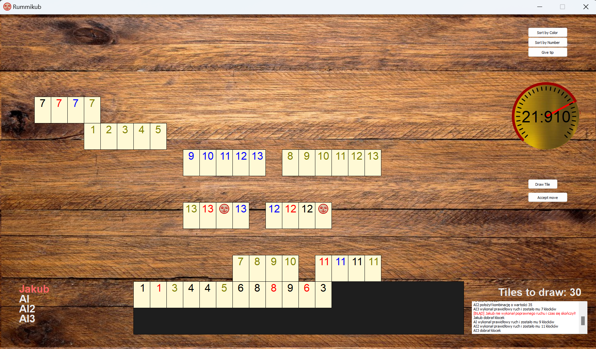

# Rummikub in Python

## Basic instructions
Bottom left corner: indication of the player who currently has a move
- red color - the current player
- white color - the rest of the players 

The rules of Rummikub are followed, so on the first move you have to set out tiles with a total value >= 30 (without using the tiles present on the board). This is worth taking into account, as sometimes it may seem that the move check or highlighting does not work correctly, but then it most likely means that it is still the first move of the player in question.

## Functionality 

- Drag and drop - Tiles can be dragged and are later snapped into grid. The method also takes into account attempts to place one tile on top of another or placing it outside the board
- Highlighting movement possibilities - red rectangle after clicking a block (with 2+ elements in a group on the board)
- Autosorting by color and by numbers - buttons in the upper right corner
- Analog timer - shows remaining time
- Checking the correctness of the move - happens after clicking the accept move button, drawing a tile, or after the time passes. In the latter two cases, the move is undone if it is incorrect. In the first, a warning is displayed in the logger.
- Multiselect - holding left mouse button on empty space draws the selection area. When picking any of the selected blocks, all selected blocks will be dragged.
- Logger - in the lower right corner + print to screen + to logfile.log file
- Ability to play against AI - up to 4 players
- Ability to play online - in one network
- Loading previous configurations
- Saving game history and ability to rewind it and jump into specific moment

### Python 3.8

